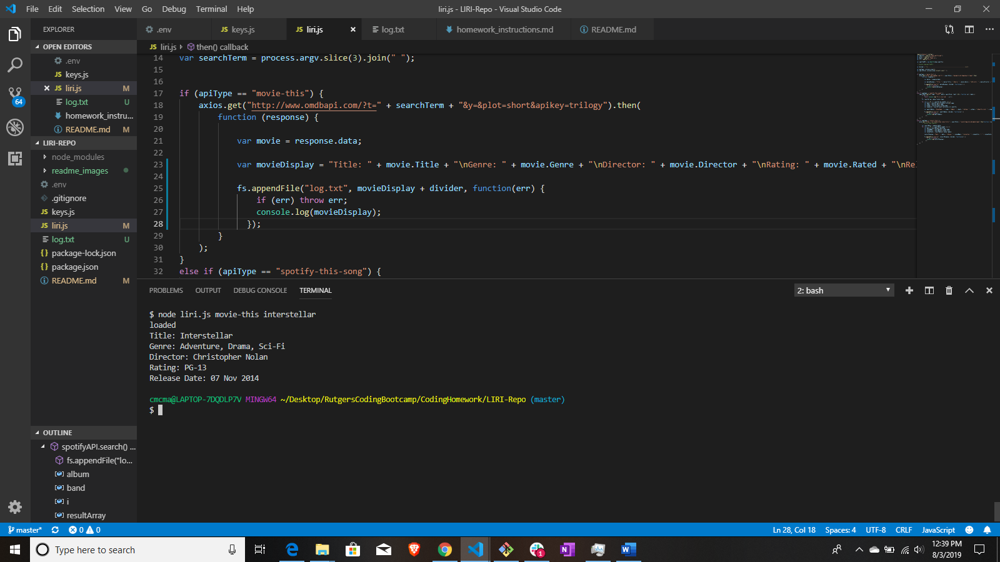
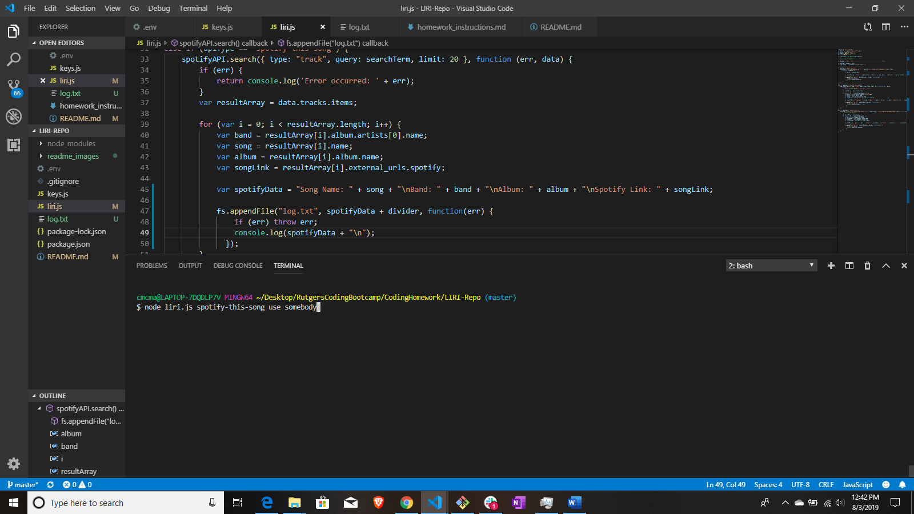
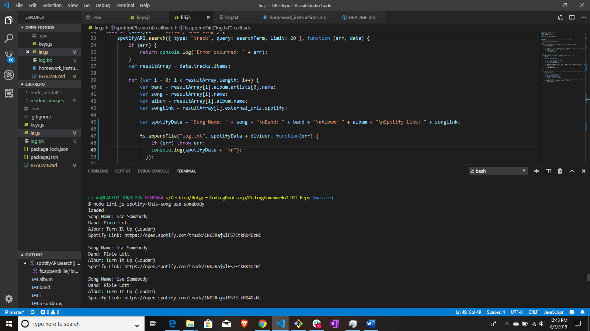
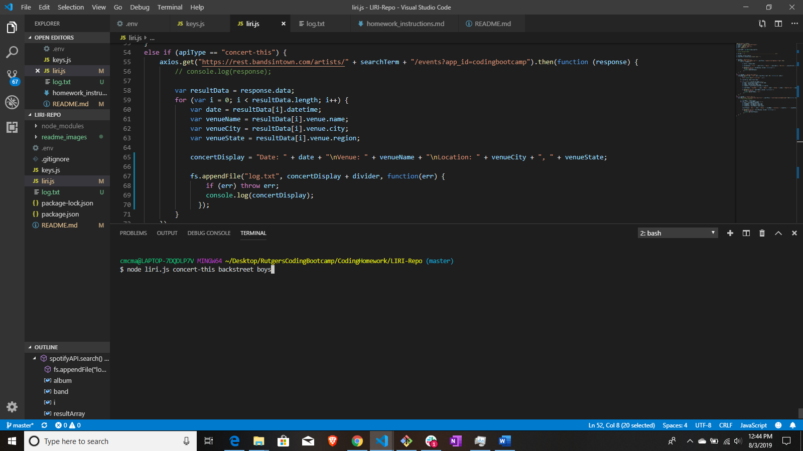
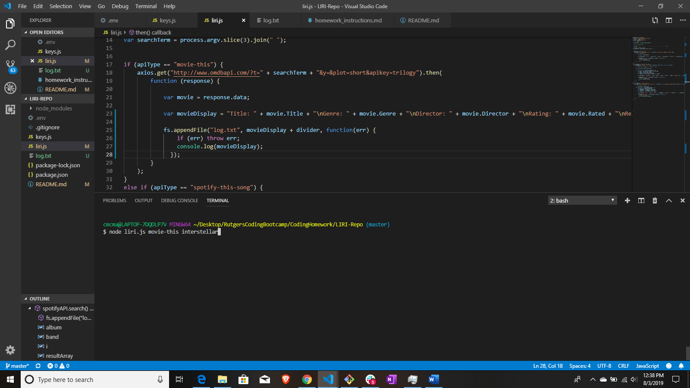

# LIRI-Repo

The goal of this app is to be able to interact with multiple APIs through the Command Line Interface (CLI).

LIRI is organized as such:

 * It uses the NODE CLI to take "user" input, distinguish between the types of input (defined below), and return results in an organized/readable manor.

 * The first input will determine the type of search, therein the API to use for the search.

 * The inputs should only be as follows:
    - "movie-this" searches for movie data using the OMDB API.
    - "spotify-this" uses the spotify API to pull up song data.
    - "concert-this" uses the Bandsintown API to search for upcoming concerts.

* Following the first input, we need a second. This will be the name of the movie, name of the song, or name of the band you want to search, depending on the the API you are trying to use.

OMDB Search Example:

OMDB Result:

Spotify Search Example:

Spotify Result:

BandsInTown Search Example:

BandsInTown Result:

